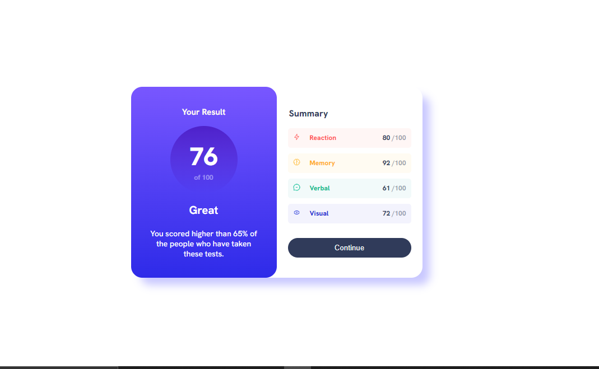

# Frontend Mentor - Results summary component solution

This is a solution to the [Results summary component challenge on Frontend Mentor](https://www.frontendmentor.io/challenges/results-summary-component-CE_K6s0maV). Frontend Mentor challenges help you improve your coding skills by building realistic projects. 

### Screenshot
 
### Links

- Solution URL: [Add solution URL here](https://your-solution-url.com)
- Live Site URL: [Add live site URL here](https://your-live-site-url.com)

## My process

### Built with

- HTML5 
- CSS
- Flexbox
- CSS Grid
- Mobile-first workflow

## Author

- Website - [DEMO](https://resultsumarrydemo.netlify.app)
- Frontend Mentor - [@Egbe-Fred](https://www.frontendmentor.io/profile/Egbe-Fred)
